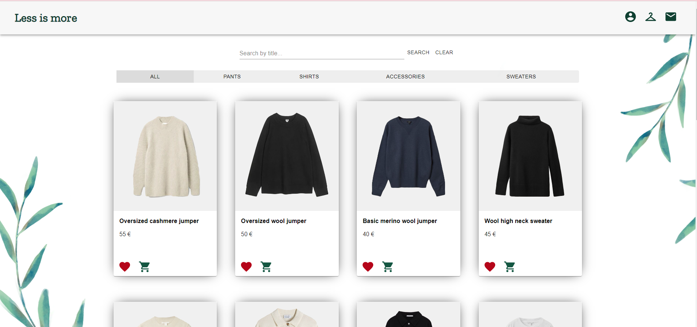
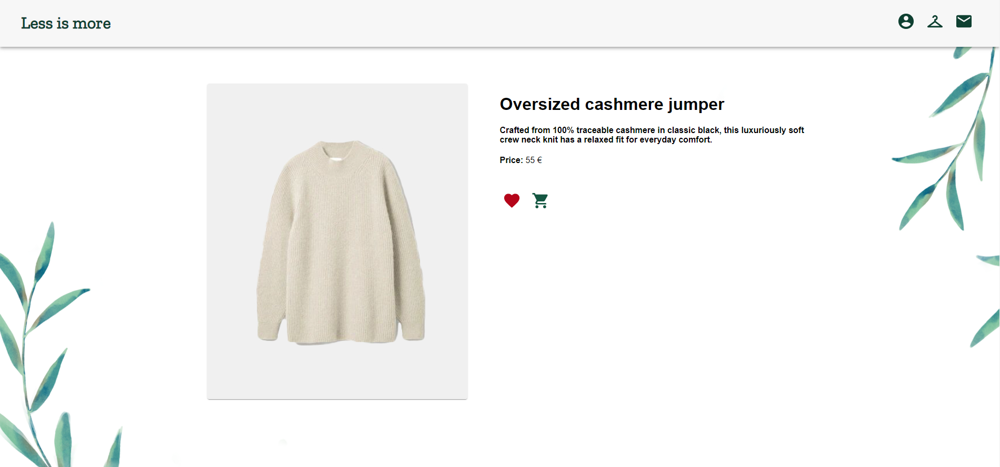

# LessIsMore
An online e-shop mockup app. 

## Features
This app has basic CRUD operations, so while using this app users can:
* Create an account
* Sign in to their account
* Edit their account information
* Add products to the cart
* Select size and quantity of product
* View product cart
* Add products to favorites list
* Remove products from favorites list
* Subscribe to newsletter
* Search products by title
* Filter products by category

On this app an admin can:
* Create a new product
* Remove a product
* Update products information or photo
* View newsletter subscribers
* Create a coupon
* View all orders

## Screenshots



## Technologies
Project is created with:
* Node.js
* Express
* MongoDB
* Bcrypt
* Jsonwebtoken
* Multer
* Cloudinary
* React
* React-router
* Axios
* Material-ui

## Setup

### Create Cloudinary account:
1. First, create a Cloudinary account:

2. Choose preferred sign up method

3. Go through initial questions

4. In your account, in the header select "Dashboard". Below you will see Cloudinary credentials, which are needed for setup later.


### Clone project to your machine:
5. Clone repository:
```
git clone https://github.com/ibabaityte/LessIsMore.git
```
### Install and setup server
6. Get in the api folder:
```
cd api
```
7. Setup some environment variables, which are found at "Dashboard" section in your Cloudinary account:
```
echo CLOUDINARY_CLOUD_NAME=*your Cloudinary Cloud Name* >> .env
echo CLOUDINARY_API_KEY=*your Cloudinary API Key* >> .env
echo CLOUDINARY_API_SECRET=*your Cloudinary API Secret* >> .env
```
8. Install dependencies:
```
npm i
```
9. Seed the database by adding products and an administrator account:
```
node seed.js
```
10. Start server:
```
npm start
```

### Install client
11. Get in the client folder:
```
cd client
```
12. Install dependencies:
```
npm i
```
13. Start server:
```
npm start
```

## Notes
* To access admin panel, sign in with these credentials:

email: admin123@admin123.com

password: admin123
