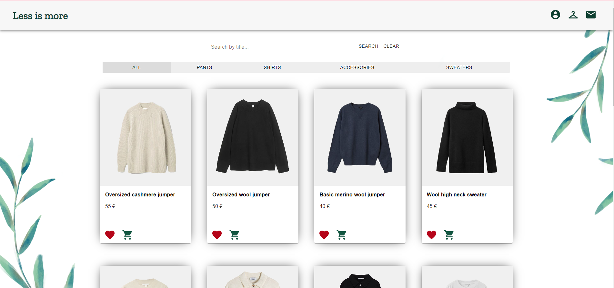
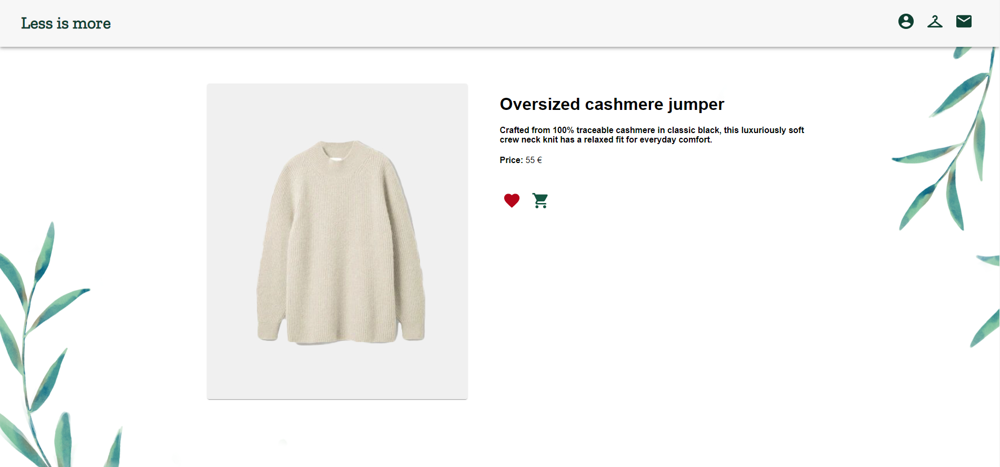

# LessIsMore
An online e-shop mockup app. 

## Features
This app has basic CRUD operations, so while using this app users can:
* Create an account
* Sign in to their account
* Edit their account information
* Add products to the cart
* Select size and quantity of product
* View product cart
* Add products to favorites list
* Remove products from favorites list
* Subscribe to newsletter
* Search products by title
* Filter products by category

On this app an admin can:
* Create a new product
* Remove a product
* Update products information or photo
* View newsletter subscribers
* Create a coupon
* View all orders

## Screenshots



## Technologies
Project is created with:
* Node.js
* Express
* MongoDB
* Bcrypt
* Jsonwebtoken
* Multer
* Cloudinary
* React
* React-router
* Axios
* Material-ui

## Setup
1. Clone repository:
```
git clone https://github.com/ibabaityte/LessIsMore.git
```
### Install server:
2. Get in the api folder:
```
cd api
```
3. Install dependencies:
```
npm i
```
4. Start server:
```
npm start
```

### Install client
5. Get in the client folder:
```
cd client
```
6. Install dependencies:
```
npm i
```
7. Start server:
```
npm start
```
